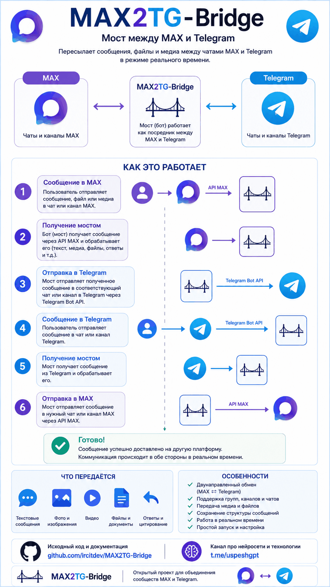

<p align="center">
  
</p>

# MAX2TG-Bridge

> Двусторонний мост между мессенджером **MAX** (`web.max.ru` / `api.oneme.ru`) и **Telegram** через форум-топики в супергруппе.

Каждый чат MAX становится отдельным форум-топиком в твоей супергруппе Telegram. Входящие сообщения из MAX (текст, фото, файлы, видео, голосовые, стикеры, контакты, локации, цитаты, пересланные) приходят в свой топик. Ответ написанный в этом топике уходит обратно собеседнику в MAX от твоего имени.

При создании топика автоматически постится и закрепляется карточка собеседника с именем, id и аватаром.

<p align="center">
  
</p>

---

## Содержание

- [Возможности](#возможности)
- [Архитектура](#архитектура)
- [Требования](#требования)
- [Установка](#установка)
- [Конфигурация](#конфигурация-env)
- [Команды бота](#команды-бота)
- [Известные ограничения](#известные-ограничения)
- [Разработка](#разработка)
- [Disclaimer](#disclaimer)
- [Лицензия](#лицензия)

---

## Возможности

### MAX → Telegram
- Текст с сохранением форматирования (жирный / курсив / зачёркнутый / подчёркнутый / моноширинный / цитата / ссылки)
- Фото с подписью
- Видео (полное скачивание, если приходит как `FILE` с расширением `.mp4`/`.mov`/…; если `_type=VIDEO` — превью-кадр)
- Документы любых типов
- Голосовые и аудио (когда MAX отдаёт `_type=AUDIO`; для нового `_type=UNSUPPORTED` пока fallback на «не удалось скачать»)
- Стикеры
- Контакты, локации, ссылки-превью
- Пересланные сообщения и цитаты с подписью отправителя
- Уведомления о статусе подключения к MAX в General-топик (с троттлингом)

### Telegram → MAX
- Текст с форматированием (`STRONG`, `EMPHASIZED`, `STRIKETHROUGH`, `UNDERLINE`, `MONOSPACED`, `BLOCKQUOTE`, `LINK`)
- Фото (через нативный photo-upload MAX, опкод 80)
- Документы, видео, аудио (через file-upload MAX, опкод 87)
- Голосовые приходят в MAX как файл `.ogg` (опкод нативной voice-загрузки пока не реверсен)
- Реакция 👀 на успешную доставку, текст ошибки от MAX — на провал

### Управление
- Авто-создание форум-топика на каждый новый чат MAX
- Закреплённая карточка профиля при создании топика
- Команды: `/bind`, `/add`, `/profile`, `/intro`, `/del`, `/help`
- Опциональное ограничение «отвечать может только владелец» (`TG_ALLOWED_USER_ID`)
- SOCKS5-прокси для Telegram (`TG_PROXY`)
- Карта связок переживает рестарт (`state/topics.json`)
- Авто-переподключение к MAX и алёрт при обрыве

---

## Архитектура

```
  ┌────────────────┐    WebSocket    ┌──────────────────┐
  │  ws-api.       │  ◄────────────► │   max2tg (app)   │
  │  oneme.ru      │                 │  ├ MaxClient     │
  └────────────────┘                 │  ├ Resolver      │
                                     │  ├ TelegramSender│
  ┌────────────────┐    Bot API      │  └ tg_handler    │
  │ api.telegram.  │  ◄────────────► │                  │
  │ org            │                 │  state/topics.json│
  └────────────────┘                 └──────────────────┘
```

- `app/main.py` — точка входа: загружает `.env`, поднимает MaxClient (WS), Telegram Application (polling), привязывает их через TopicStore.
- `app/max_client.py` — WebSocket-клиент MAX. Опкоды auth/dispatch/send/upload, retries, reconnect.
- `app/max_listener.py` — приём сообщений из MAX, маршрутизация в Telegram-топики, авто-создание топиков, постинг карточки.
- `app/resolver.py` — кеш контактов и чатов MAX.
- `app/tg_sender.py` — отправка в Telegram, `ensure_topic` (создание форум-топиков, переименование при появлении настоящего имени).
- `app/tg_handler.py` — команды и медиа из Telegram → MAX.
- `app/topics.py` — `TopicStore`: атомарно-сохраняемая JSON-карта `max_chat_id ↔ telegram_thread_id`.

---

## Требования

- Python **3.12+** (для локального запуска)
- Docker + docker-compose v2 (для рекомендуемого деплоя)
- Аккаунт MAX (`web.max.ru`)
- Супергруппа Telegram с **включёнными темами** (Topics / Forum)
- Telegram-бот (через [@BotFather](https://t.me/BotFather)) — администратор супергруппы с правом «**Управление темами**»

---

## Установка

### 1. Подготовка Telegram

1. Создай супергруппу и в её настройках включи **«Темы» / «Topics»**.
2. У [@BotFather](https://t.me/BotFather) сделай нового бота → запиши **`TG_BOT_TOKEN`**.
3. Добавь бота в супергруппу администратором, поставь галку «Управление темами» (без этого права бот не сможет создавать топики).
4. Получи **`TG_CHAT_ID`** супергруппы: перешли любое сообщение из неё боту [@userinfobot](https://t.me/userinfobot) — он покажет id вида `-100…`.
5. (Опционально) Свой Telegram-user-id — для `TG_ALLOWED_USER_ID` (тот же @userinfobot в личке).
6. В настройках реакций супергруппы разреши «**Все эмодзи**», чтобы бот мог ставить 👀 на отправленные ответы.

### 2. Получение токенов MAX

1. Открой [web.max.ru](https://web.max.ru) в Chrome/Firefox и войди.
2. F12 → вкладка **Application** → **Local Storage** → `https://web.max.ru`.
3. Скопируй значения:
   - `__oneme_auth` → **`MAX_TOKEN`**
   - `__oneme_device_id` → **`MAX_DEVICE_ID`**

> Этими значениями можно полностью завладеть аккаунтом MAX — не показывай никому.
> При логине в web.max.ru с другого устройства токен может ротироваться — тогда повторите шаги выше и обновите `.env`.

### 3. Деплой (Docker, рекомендованный)

```bash
git clone https://github.com/ircitdev/MAX2TG-Bridge.git max2tg
cd max2tg
cp .env.example .env
# отредактируйте .env
docker compose up -d --build
docker compose logs -f
```

Готово. Бот в General-топике супергруппы пришлёт `✅ Max: подключён | чатов: N`. При первом входящем сообщении из MAX автоматически создастся топик.

Том `./state` хранит карту `max_chat_id ↔ thread_id` (`state/topics.json`) — не теряй его, иначе при следующих сообщениях создадутся дубли топиков.

### 4. Локальный запуск (для разработки)

```bash
python -m venv .venv
source .venv/bin/activate   # Windows: .venv\Scripts\Activate.ps1
pip install -r requirements.txt
cp .env.example .env  # отредактировать
python -m app.main
```

### 5. systemd (Linux)

`/etc/systemd/system/max2tg.service`:
```ini
[Unit]
Description=MAX2TG-Bridge
After=network.target

[Service]
Type=simple
WorkingDirectory=/opt/max2tg
ExecStart=/opt/max2tg/.venv/bin/python -m app.main
EnvironmentFile=/opt/max2tg/.env
Restart=always
RestartSec=10

[Install]
WantedBy=multi-user.target
```

```bash
sudo systemctl daemon-reload
sudo systemctl enable --now max2tg
sudo journalctl -u max2tg -f
```

---

## Конфигурация `.env`

| Переменная | Обязательная | Описание |
|---|---|---|
| `MAX_TOKEN` | да | `__oneme_auth` из Local Storage web.max.ru |
| `MAX_DEVICE_ID` | да | `__oneme_device_id` оттуда же |
| `TG_BOT_TOKEN` | да | Токен бота от @BotFather |
| `TG_CHAT_ID` | да | ID супергруппы (отрицательное число вида `-100…`) |
| `TG_ALLOWED_USER_ID` | нет | Свой Telegram-user-id — ограничивает кто может слать команды и ответы |
| `MAX_CHAT_IDS` | нет | Список chat_id MAX через запятую — если задан, обрабатываются только эти чаты |
| `TG_PROXY` | нет | SOCKS5-прокси для Telegram, формат `socks5://[user:pass@]host:port` |
| `STATE_DIR` | нет | Папка для `topics.json` (по умолчанию `state`) |
| `REPLY_ENABLED` | нет | `true` — включить ответы из топиков в MAX |
| `DEBUG` | нет | `true` — verbose-логи + dump JSON в `debug/` |

---

## Команды бота

Все команды работают только в супергруппе (`TG_CHAT_ID`). При `TG_ALLOWED_USER_ID` — только от этого пользователя.

| Команда | Что делает |
|---|---|
| `/bind <chat_id или URL> [название]` | Создать топик под конкретный чат MAX. URL вида `https://web.max.ru/<chat_id>` тоже принимается. |
| `/add <https://max.ru/join/...>` | Открыть групповую/канальную ссылку MAX, создать топик и поставить карточку. |
| `/profile` | (в топике) Показать профиль собеседника MAX: имя, id, аватар. |
| `/intro` | (в топике) Перепостить и закрепить карточку профиля. |
| `/del` | (в топике) Удалить топик и снять связь с MAX-чатом (с подтверждением). |
| `/help` | Список всех команд. |

---

## Известные ограничения

1. **Голосовые TG → MAX** приходят как `.ogg` файл, а не как нативное voice-bubble: настоящий опкод MAX для voice-upload пока не реверсен (см. issue в [nsdkinx/vkmax#14](https://github.com/nsdkinx/vkmax/issues/14)).
2. **Голосовые MAX → TG** иногда приходят с `_type=UNSUPPORTED` (новый формат MAX). Опкод 84 для download — это сервис звонков, не аудио. Без рабочего download мы шлём в TG fallback-сообщение «голосовое сообщение (Xс) — не удалось скачать».
3. **Ссылки `/u/<token>`** (user share) `/add` пока не открывает — опкод 57 ищет в chat-namespace и возвращает `not.found`. Workaround: открыть такую ссылку напрямую в MAX, авто-топик создастся при первом сообщении.
4. **Лимит Telegram Bot API** — 20 МБ на загрузку файла ботом. Большие файлы из топика не дойдут до MAX.
5. **Кастомные эмодзи как реакции** — Telegram запрещает ботам ставить custom-emoji реакции, поэтому используется обычная `👀`.
6. **Phone / about** в `/profile` отсутствуют — опкод `CONTACT_GET` (32) возвращает только имя и аватар.
7. **Ротация MAX-токена** — если ты залогинишься в web.max.ru с другого устройства, токен моста может стать невалидным (handshake висит без `Authorized!`). Решение: обновить `MAX_TOKEN` в `.env`.

---

## Разработка

### Тесты

```bash
pip install pytest pytest-asyncio
pytest -q
```

Покрытие: `app/topics.py` (TopicStore), `app/config.py` (загрузка env), `app/max_listener.py` (форматирование, throttle), `app/tg_handler.py` (роутинг команд и медиа), `app/max_client.py` (опкоды). 191 тест.

### Структура проекта

```
max2tg/
├── app/
│   ├── main.py             # точка входа
│   ├── config.py           # загрузка .env
│   ├── max_client.py       # MAX WebSocket клиент
│   ├── max_listener.py     # MAX → TG роутинг
│   ├── resolver.py         # кеш контактов / чатов
│   ├── tg_sender.py        # TG отправка + ensure_topic
│   ├── tg_handler.py       # TG → MAX роутинг и команды
│   └── topics.py           # TopicStore (JSON-карта)
├── tests/                  # 191 pytest
├── docs/cover.jpg          # обложка README
├── state/                  # рантайм-данные (gitignored)
├── logs/                   # логи (gitignored)
├── docker-compose.yml
├── Dockerfile
├── requirements.txt
├── CLAUDE.md               # контекст для AI-ассистентов
└── README.md
```

---

## Disclaimer

1. Проект **независимый, неофициальный**, не связан с разработчиками MAX (VK Group) или Telegram (TG Messenger Inc.).
2. Использует **reverse-engineered** протокол MAX (WebSocket `ws-api.oneme.ru`). Протокол может измениться без предупреждения — мост может перестать работать.
3. Работает как **userbot** к твоему MAX-аккаунту — есть формальный риск блокировки по правилам сервиса. Используй на свой страх и риск.
4. Программа предоставляется **«как есть»**, без гарантий.

---

## Лицензия

[MIT](LICENSE), на основе [Aist/max2tg](https://github.com/Aist/max2tg).
Большое спасибо [nsdkinx/vkmax](https://github.com/nsdkinx/vkmax) и [max-messenger/max-botapi-python](https://github.com/max-messenger/max-botapi-python) за документацию опкодов и enum'ы стилей.
